# Model

Het staat model voor digitale tuintjes welke bij 'Het web is voor iedereen' door studenten worden gemaakt.

Mijn online model kan je hier vinden: <a href="https://twanee.nl/"> DigiTuintje</a>
Een fork van de model repository gemaakt en gepubliceerd via mijn eigen Github omgeving.
Website voor inspiratie, OVERNEMEN!!!
/_ https://www.niccolomiranda.com/ _/

  
 De model komt van de <a href="https://github.com/CMDA/model">CMDA/model fork</a> repository op GitHub.

  
 mijn model komt van de <a href="https://github.com/T-Eek/TwansDigiTuintje">T-Eek/TwansDigiTuintje</a> repository op GitHub.

<h1 class="RealHeader">## Learning Log...</h1>
<!-- <h1>[Digitaal Tuintje van ...]</h1> -->
  

    

      

        
          <article>
            <h3> Sprint 0  
              Kickoff 31 Augustus
            </h3>
            
Werd er een <b>Kickoff</b> gehouden en moesten we, een fork van de school repository maken en je eigen model repository publiceren via je eigen Github omgeving. 

          </article>
        
        

        

          

            

              <a target="_blank" href="assets/Images//31Aug/HWIVIZelfTestimage1.png">
                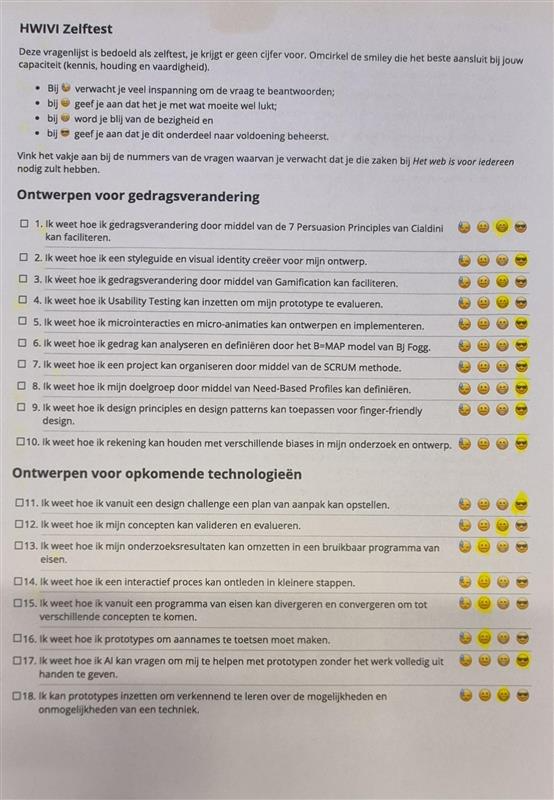
              </a>
              
Add a description of the image here

            

          

            

              <a target="_blank" href="assets/Images/31Aug/HWIVIZelfTestimage2.png">
                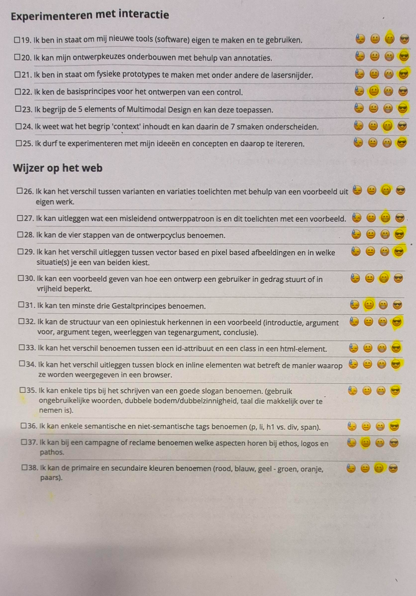
              </a>
              
Add a description of the image here

            

          

        

          

            
              <h3>Vragen</h3>
              <ul>
                <li class="AugustVraag1">
                  <strong>1. Leg uit wat een source hosting platform is en voor welke jij gekozen hebt: </strong>Ik heb mijn source hosting platform github gekozen omdat ik weet hoe github werkt, het is gratis en heel erg toegankelijk
                </li>
                <li class="AugustVraag2">
                  <strong>2. Leg uit wat een repository is en hoe je deze aanmaakt:</strong> Een repository is een plek waar je bestanden kan opslaan, ik heb mijn repository aangemaakt door op de knop "New" te klikken en een naam te geven aan mijn repository.
                </li>
                <li class="AugustVraag3">
                  <strong>3. Beschrijf hoe je aanpassingen aan jouw pagina kunt maken en hoe je er voor zorgt dat die op het web gepubliceerd worden:</strong> Aanpassingen doe ik via HTML, CSS and een beetje javascript, dit wil ik allemaal in Visual Studio Code doen, omdat het daar net zo makkelijk te publiceren is en op te
                  slaan, zodat ik er weer snel aan kan werken en eventuele snelle
                </li>
              </ul>
            
          

        

      

    

    <h1></h1>
    

      

        
          <article>
            <h3>Sprint 1  
              2 September
            </h3>
            
Was de <b>Eerste</b> echte les van mijn 2de jaar van de opleiding CMDA, en moesten we, een fork van de school repository maken en je eigen model repository publiceren via je eigen Github omgeving.

          </article>
        
        

          

            

              

                <a target="_blank" href="assets/Images/2Sep/AppIdeeimage.png">
                  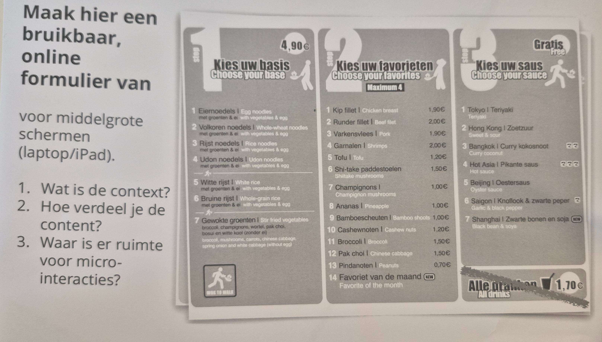
                </a>
                
Add a description of the image here

              

            

            

              

                <a target="_blank" href="assets/Images/2Sep/SchetsimageFeedback1.png">
                  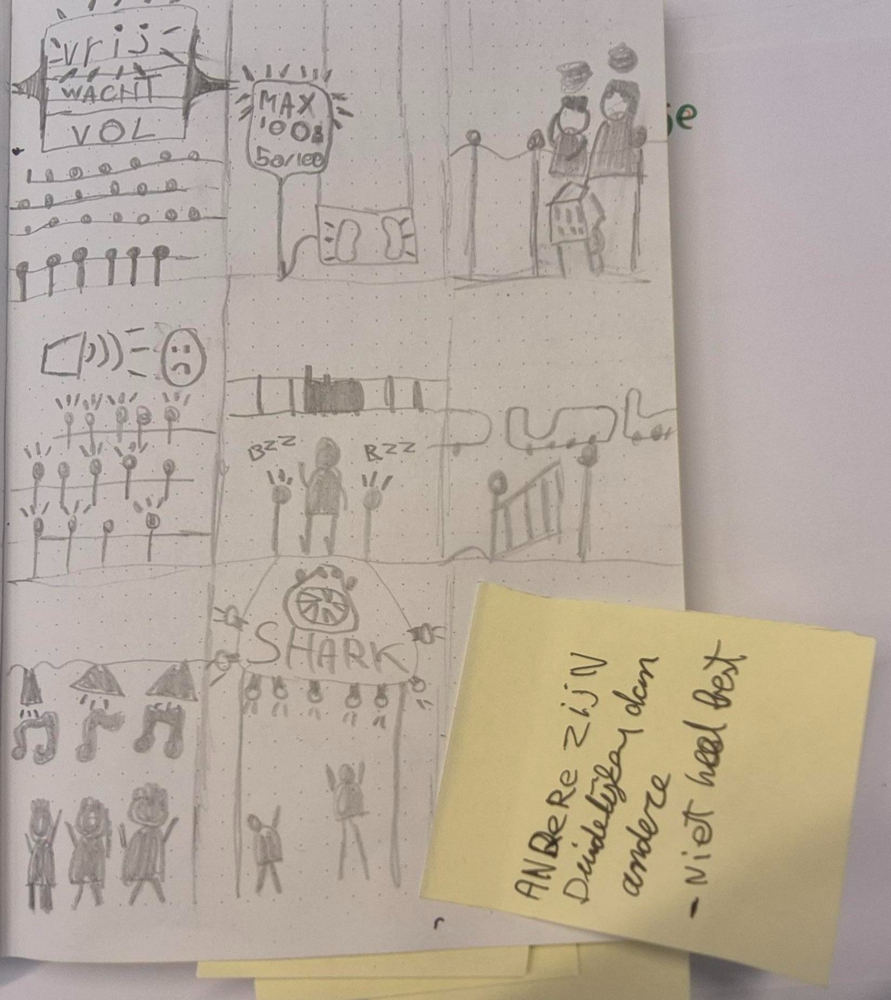
                </a>
                
Add a description of the image here

              

            

            

              

                <a target="_blank" href="assets/Images/2Sep/SchetsimageReflectie2.png">
                  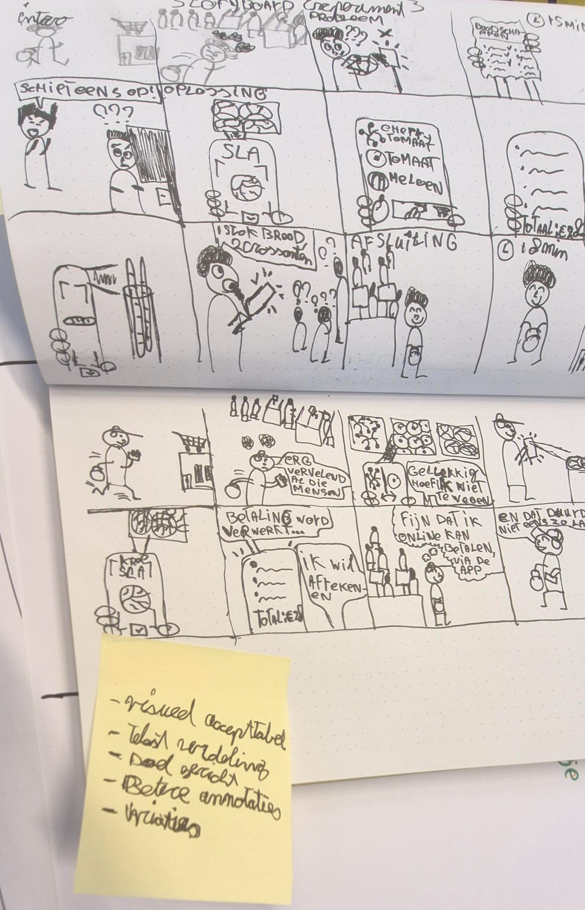
                </a>
                
Add a description of the image here

              

            

            

              

                <a target="_blank" href="assets/Images/2Sep/Linesimage1.png">
                  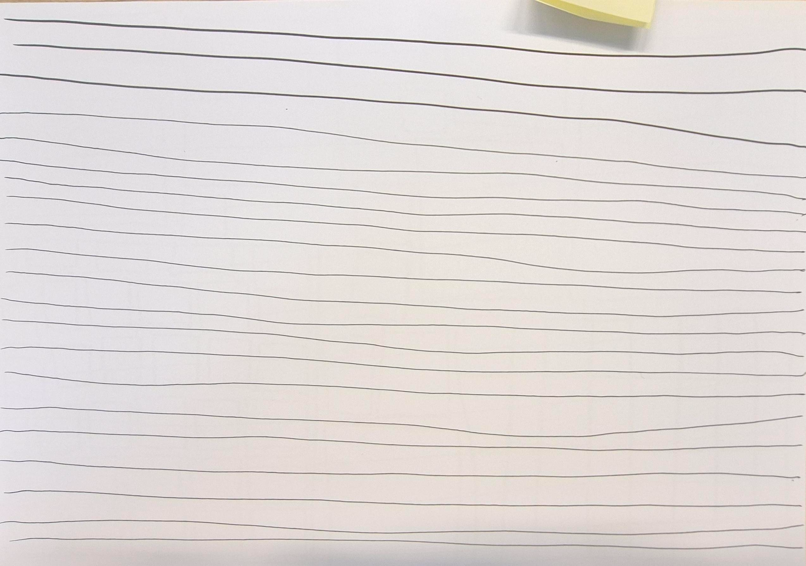
                </a>
                
Add a description of the image here

              

            

            

              

                <a target="_blank" href="assets/Images/2Sep/Linesimage2.png">
                  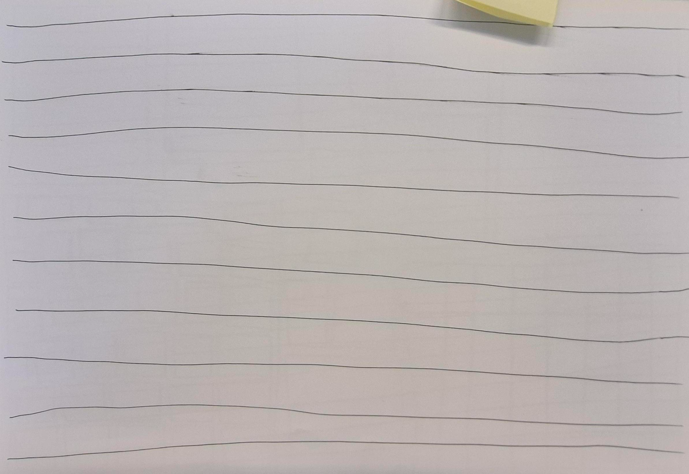
                </a>
                
Add a description of the image here

              

            

            

              

                <a target="_blank" href="assets/Images/2Sep/Vierkantimage.png">
                  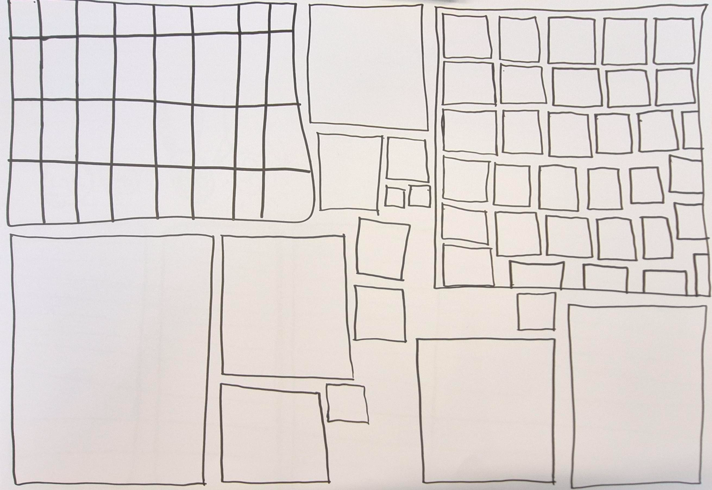
                </a>
                
Add a description of the image here

              

            

            

              

                <a target="_blank" href="assets/Images/2Sep/SchetsimageDepth.png">
                  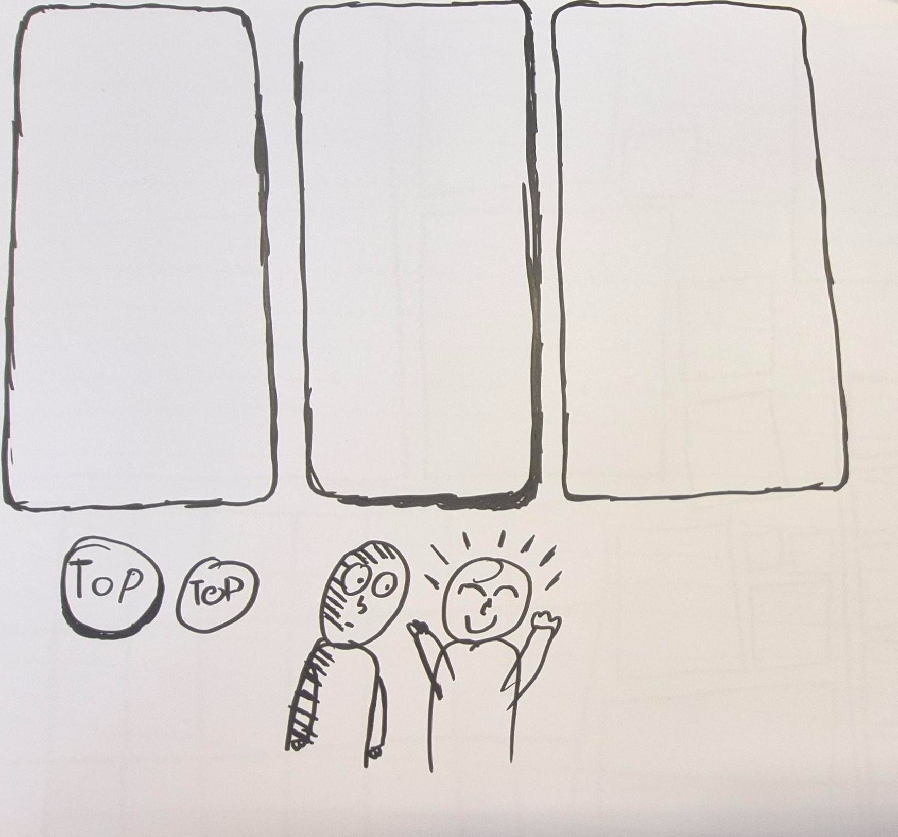
                </a>
                
Add a description of the image here

              

            

                            

                                

                                    <a target="_blank" href="assets/Images/2Sep/SchetsimageZara.png">
                                        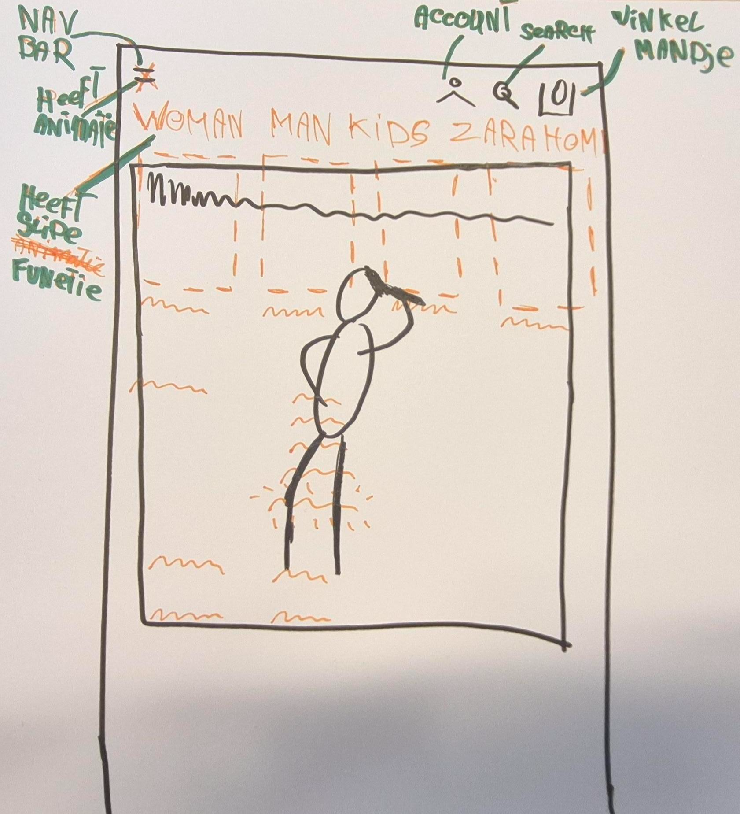
                                    </a>
                                    
Add a description of the image here

                                

                            

                            

                                

                                    <a target="_blank" href="assets/Images/2Sep/LCimagePortret.png">
                                        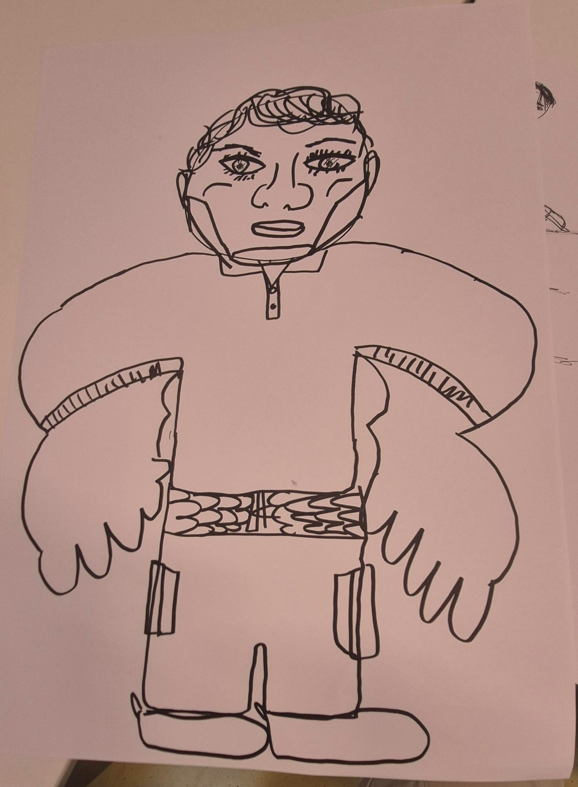
                                    </a>
                                    
Add a description of the image here

                                

                            

                            

                                

                                    <a target="_blank" href="assets/Images/2Sep/LCimageSchild.png">
                                        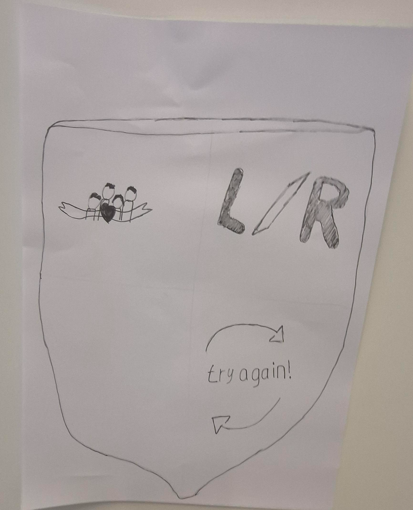
                                    </a>
                                    
Add a description of the image here

                                

                            

                        

                    

                

            

    h1></h1>
            

                

                    
                      <article>
                        <h3>4 September</h3>
                        
Was de <b>Eerste</b> echte les van mijn 2de jaar van de opleiding CMDA, en moesten we,
                          een fork van de school repository maken en je eigen model repository publiceren via je
                          eigen Github omgeving.
                        

                      </article>
                    
                    

                        

                            

                                

                                    <a target="_blank" href="assets/Images/4Sep/CodePenHTMLimage2.png">
                                        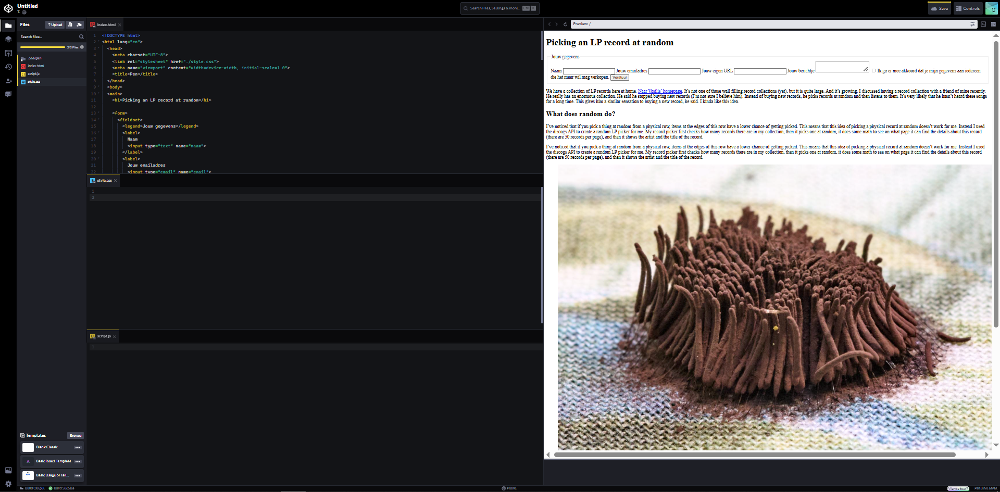
                                    </a>
                                    
Add a description of the image here

                                

                            

                            

                                

                                    <a target="_blank" href="assets/Images/4Sep/CodePenHTMLimage.png">
                                        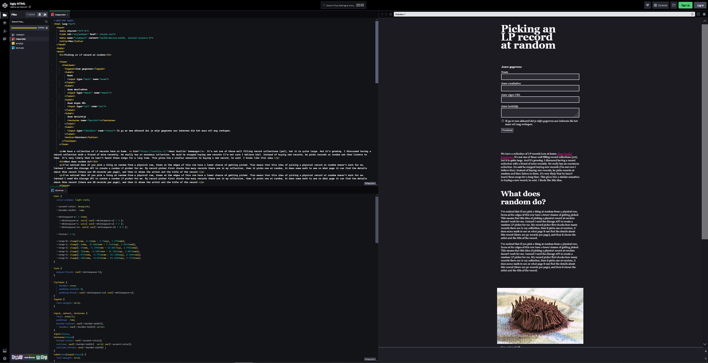
                                    </a>
                                    
Add a description of the image here

                                

                            

                        

                    

                

            

        

        <h1></h1>

THe Digital Garden:

The Six patterens of Gardening (de 6 patronen van de tuin)

- Dat het erg vaag is en tot verwarring leid
  Dat er een paar paar mensen zijn die het kunnen uitleggen
  en willen uitleggen: pattern Language (patroon taal)
  wordt dit ook wel genoemd.

Topography over Timelines (aadrijkstkunde over tijdlijnen)

- De oorsprong van een tuin valt rond om de samenhang van relaties
  en sociale communicatie links tussen elkaar doormiddel van
  concepten, en thema's, die altijd up-to-date blijft.
  De link is niet altijd even duidelijk te zien maar moet
  erin verwerkt zijn.

Continuos Growth (doorlopende voortgang)

- Je tuintje is nooit afgerond, doormiddel van aanpassingen
  en groei van jezelf en je ideeen.
  Het heeft de lezer een idee over hoe je denkt
  en je stappenplan erbij/ je uitleg erover.

Imperfection & Learing in Public

- Je tuintje is niet aan richtlijnen gebonden, daarom kan het niet perfect zijn.
  De vrijheid om je eigen persoonlijkheid op het web te zetten komt
  met een verantwoordelijkheid. Omdat je volledig vrij bent om alles
  in je tuintje te zetten, de auteur gebruikt een overly horticultural metaphor:
  - Seedlings for very rough and early ideas (schetsen/ brainstormen)
  - Budding for work I've cleaned up and clarified (analyseren en aanpassen)
  - Evergreen for work that is reasonably complete (though I still tend these over time)
    (Het afwerken van het gemaakte process

- 20 jaar heel erg in was
  - Dat de wbesites erg oud zijn
  - Dat het je eigen tuintje is inplaats van een blog of kopje

Check-out

- De checkout vragen voor vandaag:

Leg uit wat een digital garden is en waarom dat anders is dan een reguliere website.

- Een digital garden is een web dagboek die je bij houd waar je je ideeen, passie toont en dit gebeurd niet op een normale website

Leg uit wat een website 'webby' maakt en welke websites jou het meeste inspireren.

- Webby website maken het interactief en zijn dynamische

Vertel waar jij mee aan de slag wilt gaan bij het maken van jouw eigen digital garden (let op: dit zijn jouw eerste ideeën, dit kan en mag veranderen in de loop van het programma.

- het responsive te maken voor web en mobiel en dat mijn interacties er in voor komen

https://miro.com/app/board/uXjVHq1zApo=/?share_link_id=829585340391
