# Model

Het staat model voor digitale tuintjes welke bij 'Het web is voor iedereen' door studenten worden gemaakt.

Mijn online model kan je hier vinden: <a href="https://twanee.nl/"> DigiTuintje</a>
Een fork van de model repository gemaakt en gepubliceerd via mijn eigen Github omgeving.
Website voor inspiratie, OVERNEMEN!!!
/_ https://www.niccolomiranda.com/ _/

  
 De model komt van de <a href="https://github.com/CMDA/model">CMDA/model fork</a> repository op GitHub.

  
 mijn model komt van de <a href="https://github.com/T-Eek/TwansDigiTuintje">T-Eek/TwansDigiTuintje</a> repository op GitHub.

<h1 class="RealHeader">## Learning Log...</h1>
  

    

      

        
          <article>
            <h3> Sprint 0  
              Kickoff 31 Augustus
            </h3>
            
Werd er een <b>Kickoff</b> gehouden en moesten we, een fork van de school repository maken en je eigen model repository publiceren via je eigen Github omgeving. 

          </article>
        
        

        

          

            

              <a target="_blank" href="assets/Images//31Aug/HWIVIZelfTestimage1.png">
                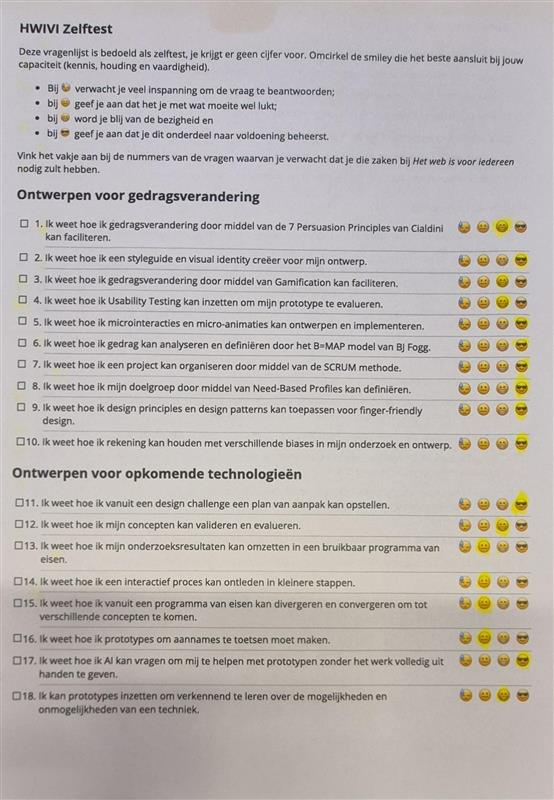
              </a>
            

          

            

              <a target="_blank" href="assets/Images/31Aug/HWIVIZelfTestimage2.png">
                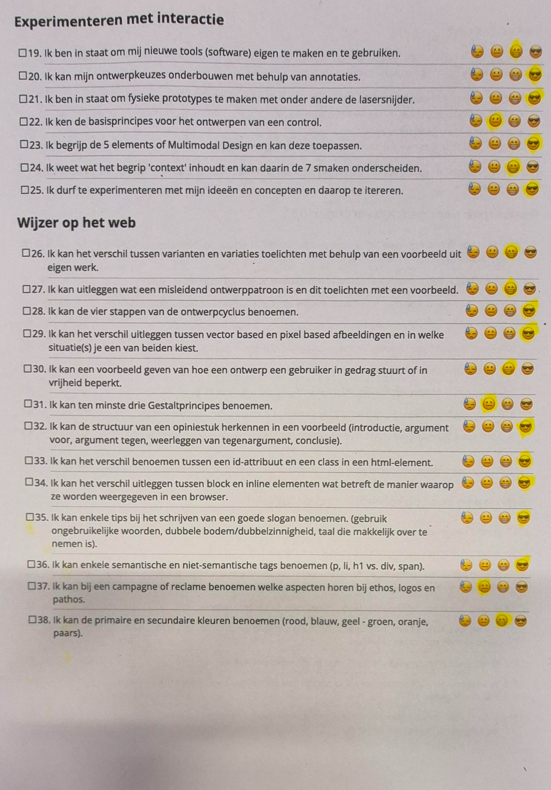
              </a>
              
Voor de HWIVI Zelftest heb ik vooral gekeken naar wat ik nog goed wist van de vorige blokken en heb hierbij mijn eerlijke beoordeling over gedeeld, waardoor ik later er later op terug kan reflecteren en belissen of het zo is gebleven of veranderd is

            

          

        

          

            
              <h3>CHeck-out Vragen Sprint 0</h3>
              <ul>
                <li class="AugustVraag1">
                  <strong>1. Leg uit wat een source hosting platform is en voor welke jij gekozen hebt: </strong>Ik heb mijn source hosting platform github gekozen omdat ik weet hoe github werkt, het is gratis en heel erg toegankelijk
                </li>
                <li class="AugustVraag2">
                  <strong>2. Leg uit wat een repository is en hoe je deze aanmaakt:</strong> Een repository is een plek waar je bestanden kan opslaan, ik heb mijn repository aangemaakt door op de knop "New" te klikken en een naam te geven aan mijn repository.
                </li>
                <li class="AugustVraag3">
                  <strong>3. Beschrijf hoe je aanpassingen aan jouw pagina kunt maken en hoe je er voor zorgt dat die op het web gepubliceerd worden:</strong> Aanpassingen doe ik via HTML, CSS and een beetje javascript, dit wil ik allemaal in Visual Studio Code doen, omdat het daar net zo makkelijk te publiceren is en op te
                  slaan, zodat ik er weer snel aan kan werken en eventuele snelle
                </li>
              </ul>
            
          

        

      

    

      

    

      

        
          <article>
            <h3>Sprint 1  
              2 September
            </h3>
            
Was de <b>Eerste</b> echte les van mijn 2de jaar van de opleiding CMDA, en moesten we, een fork van de school repository maken en je eigen model repository publiceren via je eigen Github omgeving.

          </article>
        
        

          

            

              

                <a target="_blank" href="assets/Images/2Sep/AppIdeeimage.png">
                  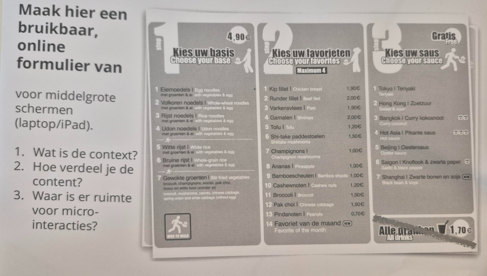
                </a>
                
Bij deze opdracht moesten we de layout, context, typografie, hiërarchie en interacties veranderen naar een verbeterde versie.
</ br>
              

            

            

              

                <a target="_blank" href="assets/Images/2Sep/SchetsimageFeedback1.png">
                  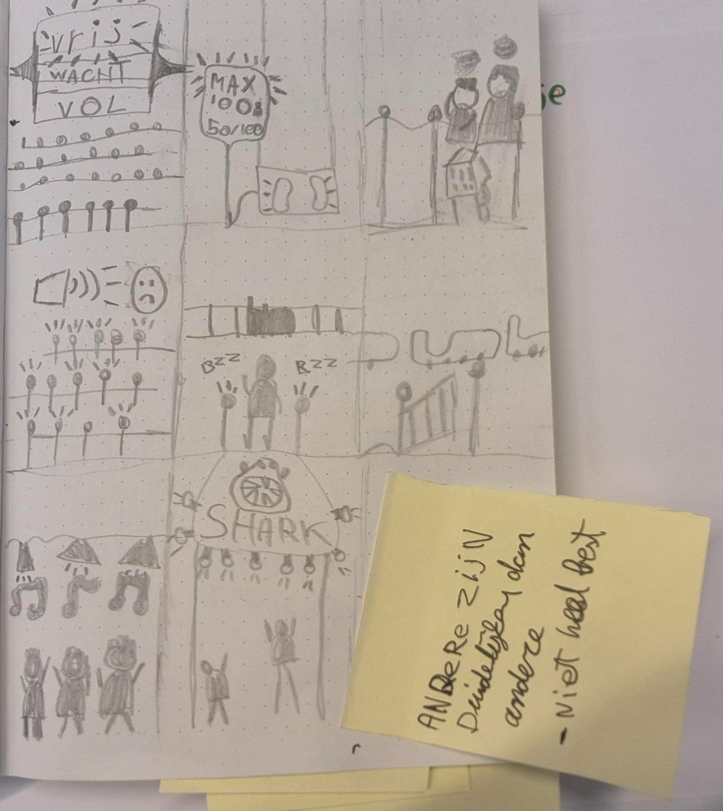
                </a>
              

            

            

              

                <a target="_blank" href="assets/Images/2Sep/SchetsimageReflectie2.png">
                  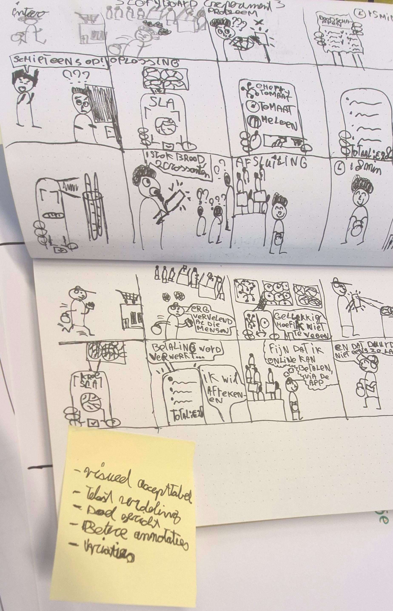
                </a>
                
Na de eetste opdracht moesten we reflecteren op onze oude schetsen en verkennend zoeken en opschrijven wat er nog meer in je eigen schetsten misten qua verduidelijking, zoals in kleur, typografie en hierarchie.
</ br>
              

            

            

              

                <a target="_blank" href="assets/Images/2Sep/Linesimage1.png">
                  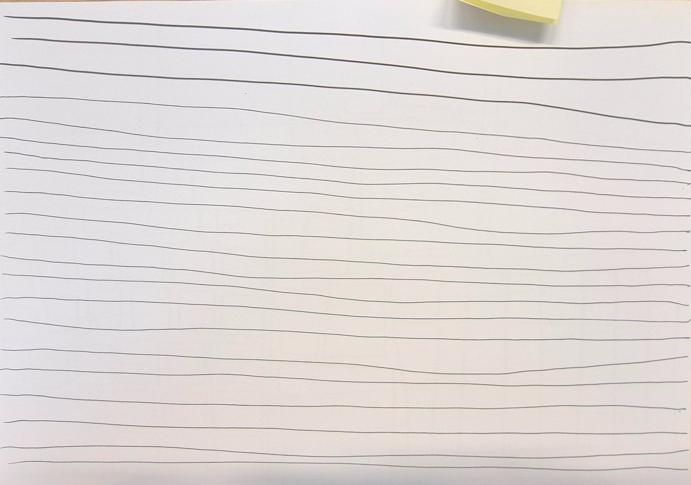
                </a>
              

            

            

              

                <a target="_blank" href="assets/Images/2Sep/Linesimage2.png">
                  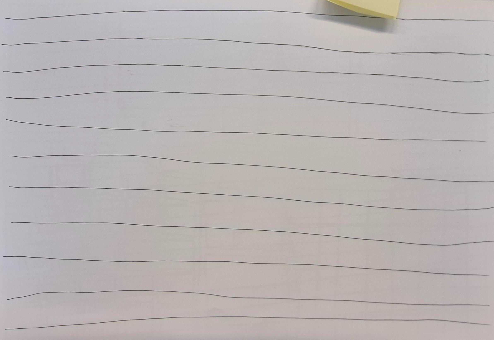
                </a>
              

            

            

              

                <a target="_blank" href="assets/Images/2Sep/Vierkantimage.png">
                  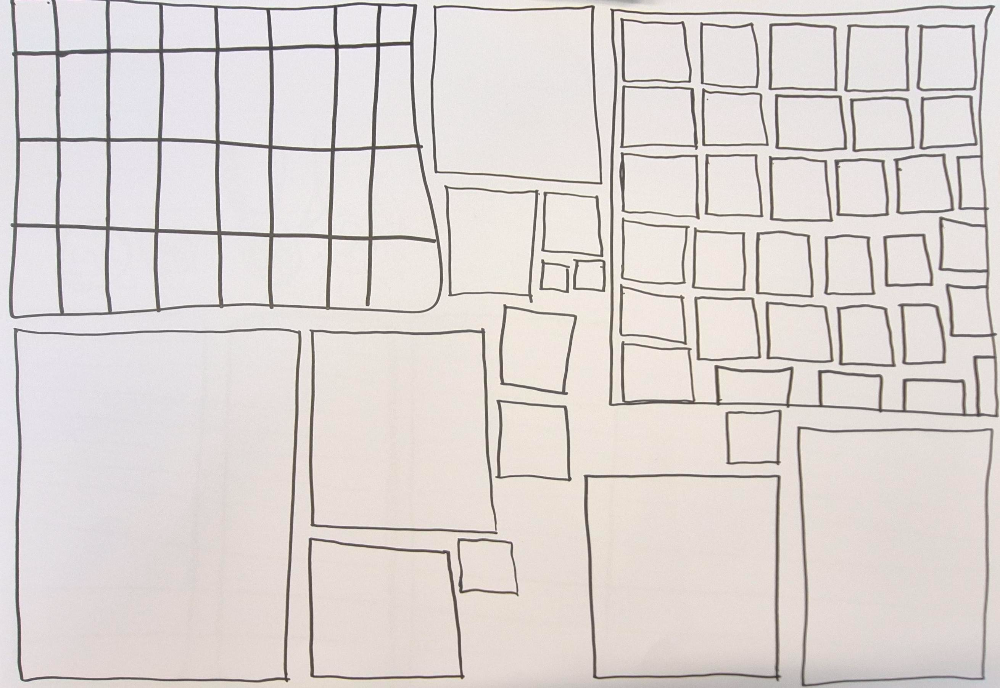
                </a>
                
Na de opdracht van de schetsen moesten we weer schetsen maar dit keer was het voor lijnen en vormen, om te kijken waar je zelf staat, of je misschien meer moet oefenen om je toekomstige schetsen te verbeteren en te verduidelijken, of dat je al op de goede weg bent
</ br>
              

            

            

              

                <a target="_blank" href="assets/Images/2Sep/SchetsimageDepth.png">
                  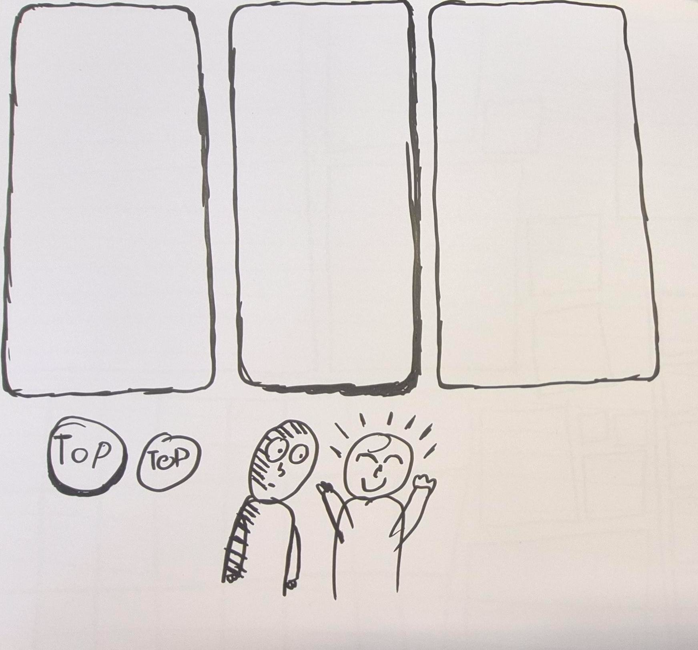
                </a>
                

                  In dezelfde opdracht moesten we ook je telefoon omring na tekenen uit de losse pols en dat viel niet zo erg mee, maar ik kreeg zelf een goed inzicht van hoe erg afhankelijk of perfectionistische kan zijn om iets simpels te tekenen zoals een telefoon, rondje, lijn en of vierkant
                
</ br>
              

            

            

              

                <a target="_blank" href="assets/Images/2Sep/SchetsimageZara.png">
                  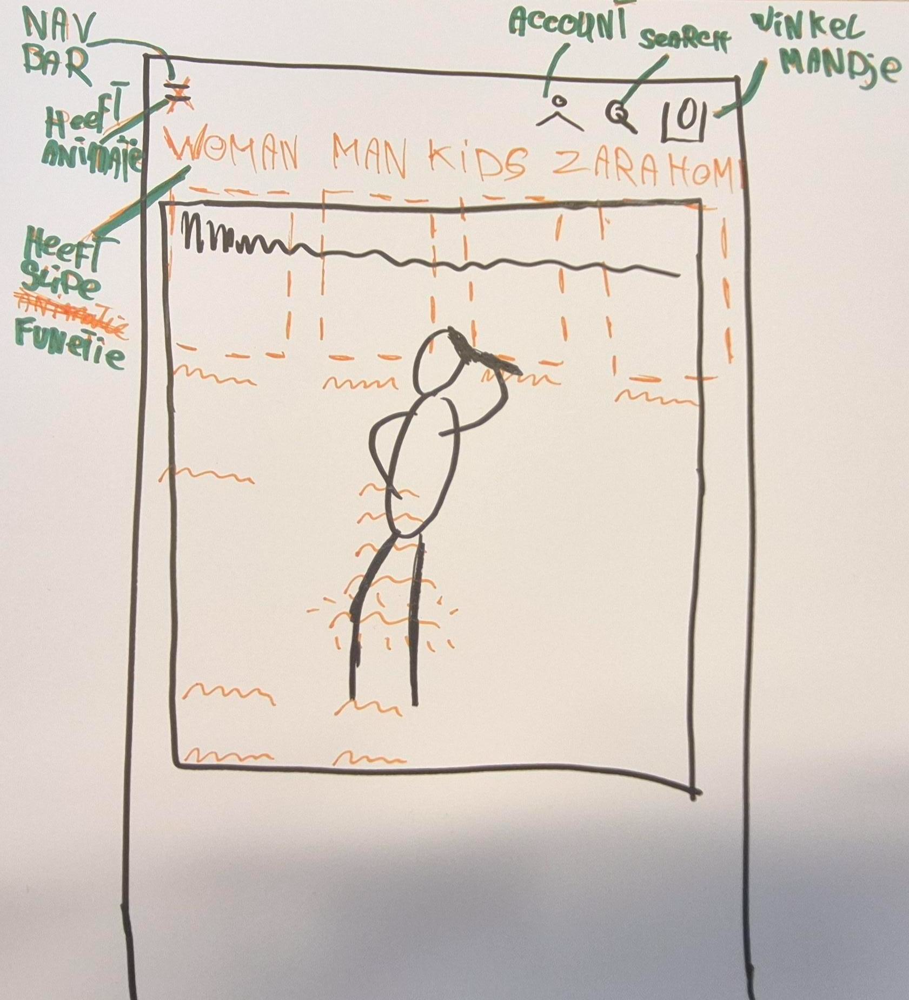
                </a>
                

                  In dezelfde opdracht moesten we een website opzoeken en de elementen na schetsten, ik heb hiervoor voor de <strong>ZARA</strong> website gekozen en zo goed proberen na te schetsen met de voor pagina van de titel, een afbeelding, als toevoeging heb ik de navigatie doormiddel van een stippellijn en andere                        kleur getekend (in het oranje) en heb ik in het groen de annotaties geschreven voor de verduidelijking van de verschillende elementen.
                
</ br>
              

            

            

              

                <a target="_blank" href="assets/Images/2Sep/LCimagePortret.png">
                  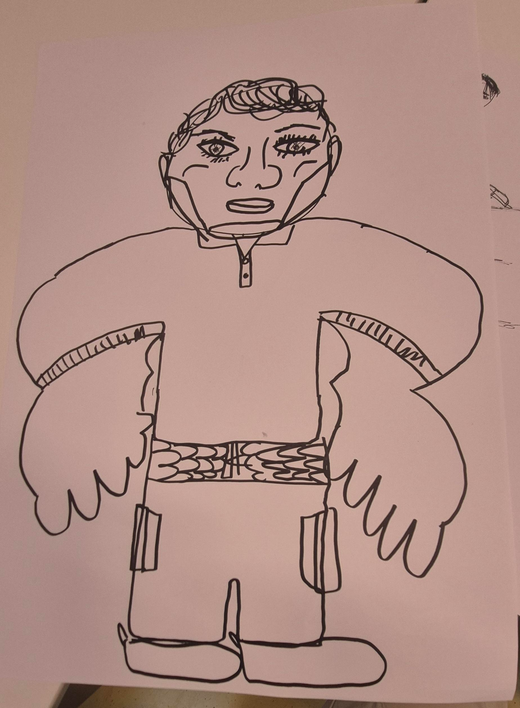
                </a>
                

                In deze opdracht moesten we 2 tallen maken en elkaar na tekenen of een gebeurtenis na tekenen van de andere persoon, Lars heeft mij zo goed mogelijk proberen na te tekenen.
                
 
              

            

            

              

                <a target="_blank" href="assets/Images/2Sep/LCimageSchild.png">
                  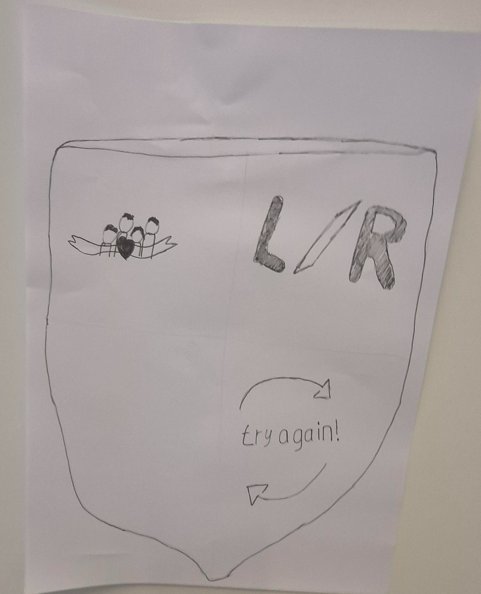
                </a>
                

                  In deze opdracht moesten we een schild maken met daarin 4 van je belangrijkste, unieke, positieve eigenschappen/ kennis die je zelf hebt, ik heb mijn familie getekend omdat mijn familie dicht bij mij staat, dan <strong>L / R</strong> dit komt omdat ik met mijn rechterhand schrijf maar met mijn linkerhand                      tennis, basketbal, vis en een deksel open draai, dit legt ook voor mijn linker voet waar ik mee voetbal en schiet, maar ik kan knippen met een schaar en tanden poetsen met alle bij.
                

              

            

          

        

      

    

      

      

        

          
            <article>
              <h3>4 September</h3>
              
Was de <b>Eerste</b> echte les van mijn 2de jaar van de opleiding CMDA, en moesten we,
                een fork van de school repository maken en je eigen model repository publiceren via je
                eigen Github omgeving.
              

            </article>
          
          

            

              

                

                  <a target="_blank" href="assets/Images/4Sep/CodePenHTMLimage2.png">
                    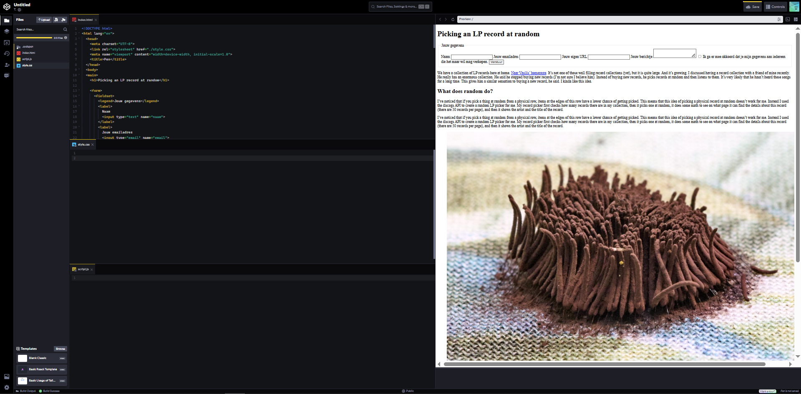
                  </a>
                

              

              

                

                  <a target="_blank" href="assets/Images/4Sep/CodePenHTMLimage.png">
                    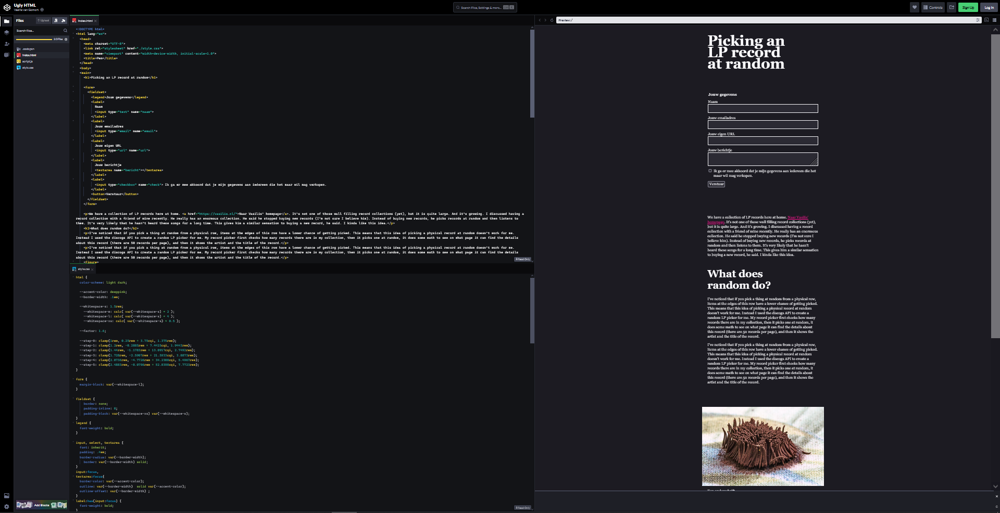
                  </a>
                  
Tijdens de Codepen opdracht moesten we een <strong>"lelijke"</strong> HTML pagina stylen, dit heb ik met CSS allemaal verbeterd."

                  
In de CSS heb ik meerdere Custom CSS properties gemaakt zoals:
                  <ul>
                    <li class="SeptemberVraag1">
                      <strong>1. --accent-color: deeppink;</strong> - is voor de kleur van de tekst: "Deeppink" in dit geval.
                    </li>
                    <li>
                      <strong>2. --border-width: .1em;</strong> - is de breedte van de input, selectie en textarea velden in het formulier
                    </li>
                    <li>
                      <strong>3. --whitespace-s: 1.5rem;</strong> - is de wit regel tussen de teksten: deze is klein, dit is aan gegeven doormiddel van een "s"
                    </li>
                    <li>
                      <strong>4. --whitespace-m: calc( var(--whitespace-s) * 2 );</strong> - is de wit regel tussen de teksten: deze is normaal, dit is aan gegeven doormiddel van een "m"
                    </li>
                    <li>
                      <strong>5. --whitespace-l: calc( var(--whitespace-s) * 4 );</strong> - is de wit regel tussen de teksten: deze is groot, dit is aan gegeven doormiddel van een "l"
                    </li>
                    <li>
                      <strong>6. --whitespace-xs: calc( var(--whitespace-s) * 0.5 );</strong> - is de wit regel tussen de teksten: deze is extra klein, dit is aan gegeven doormiddel van een "xs"
                    </li>
                    <li>
                      <strong>7. --factor: 1.6: deeppink;</strong>
                    </li>
                    <li>
                      <strong>8. --step-0: clamp(1rem, 0.25rem + 3.75cqi, 1.375rem);</strong>
                    </li>
                    <li>
                      <strong>9. --step-1: clamp(1.2rem, -0.2885rem + 7.4425cqi, 1.9443rem);</strong>
                    </li>
                    <li>
                      <strong>10. --step-2: clamp(1.44rem, -1.1783rem + 13.0917cqi, 2.7492rem);</strong>
                    </li>
                    <li>
                      <strong>11. --step-3: clamp(1.728rem, -2.5907rem + 21.5933cqi, 3.8873rem);</strong>
                    </li>
                    <li>
                      <strong>12. --step-4: clamp(2.0736rem, -4.7726rem + 34.2308cqi, 5.4967rem);</strong>
                    </li>
                    <li>
                      <strong>13. --step-5: clamp(2.4883rem, -8.0796rem + 52.8398cqi, 7.7723rem);</strong>
                    </li>
                    <h1></h1>
                    <li class="SeptemberVraag2">
                      <strong>2. Leg uit wat een website 'webby' maakt en welke websites jou het meeste inspireren.</strong>
                      - Doormiddel van @media elementen voor verschillende mobiel waardes kan je je website schalen tot een mobiel formaat en is hierdoor responsive en Webby websites maken het interactief.
                    </li>
                    <li class="SeptemberVraag3">
                      <strong>3. Vertel waar jij mee aan de slag wilt gaan bij het maken van jouw eigen digital garden (let op: dit zijn jouw eerste ideeën, dit kan en mag veranderen in de loop van het programma.</strong>
                      - het responsive te maken voor web en mobiel en dat mijn interacties er in voor komen
                    </li>
                  </ul>
                

                

              

            

          

        

      

    

    

      
        <h3>Check-out vragen Sprint 1:</h3>
        <ul>
          <li class="SeptemberVraag1">
            <strong>1. Leg uit wanneer een website 'lelijk' wordt en geef voorbeelden wat je kan doen om deze 'lelijke' onderdelen te fixen?</strong>
                Als een website geen bijpassende thema's heeft of kleuren patronen, een lettertypen dat niet leesbaar is
              1. Met micro-interacties, style en vormgeving
              - doormiddel van style en vormgeving heb je een kleuren patroon dat je website fixed van lelijkheid
          </li>
          <li class="SeptemberVraag2">
            <strong>2. Vertel welke volgende stap je neemt om je website responsive te maken.</strong>
            - Doormiddel van @media elementen voor verschillende mobiel waardes kan je je website schalen tot een mobiel formaat en is hierdoor responsive.
          </li>
          <li class="SeptemberVraag3">
            <strong>3. Kun je het ontwerp en de bouw van je eigen Garden (zo uit je hoofd) onderbouwen in Webby vocabulaire?</strong>
            - Mijn ontwerp heb ik vooral gericht op basis van de Micro interacties en de opvallende typografie, style en kleuren patronen die ik in mijn ontwerp heb getoond, om het "Webby" te maken wil ik de titel, hoofdkopjes er uit laten springen en er kleine, funcionele micro-interacties aan toevoegen
          </li>
        </ul>
      
    

    

    <h3>9 September</h3>
    
Tijdens deze opdracht moesten we een artikel <strong>verkennend</strong> lezen en een korte samenhang vertellen wat je uit de tekst hebt opgedaan

THe Digital Garden:

The Six patterens of Gardening (de 6 patronen van de tuin)

- Dat het erg vaag is en tot verwarring leid
  Dat er een paar paar mensen zijn die het kunnen uitleggen
  en willen uitleggen: pattern Language (patroon taal)
  wordt dit ook wel genoemd.

Topography over Timelines (aadrijkstkunde over tijdlijnen)

- De oorsprong van een tuin valt rond om de samenhang van relaties
  en sociale communicatie links tussen elkaar doormiddel van
  concepten, en thema's, die altijd up-to-date blijft.
  De link is niet altijd even duidelijk te zien maar moet
  erin verwerkt zijn.

Continuos Growth (doorlopende voortgang)

- Je tuintje is nooit afgerond, doormiddel van aanpassingen
  en groei van jezelf en je ideeen.
  Het heeft de lezer een idee over hoe je denkt
  en je stappenplan erbij/ je uitleg erover.

Imperfection & Learing in Public

- Je tuintje is niet aan richtlijnen gebonden, daarom kan het niet perfect zijn.
  De vrijheid om je eigen persoonlijkheid op het web te zetten komt
  met een verantwoordelijkheid. Omdat je volledig vrij bent om alles
  in je tuintje te zetten, de auteur gebruikt een overly horticultural metaphor:
  - Seedlings for very rough and early ideas (schetsen/ brainstormen)
  - Budding for work I've cleaned up and clarified (analyseren en aanpassen)
  - Evergreen for work that is reasonably complete (though I still tend these over time)
    (Het afwerken van het gemaakte process

- 20 jaar heel erg in was
  - Dat de wbesites erg oud zijn
  - Dat het je eigen tuintje is inplaats van een blog of kopje
  <h3>11 September</h3>
        
          <h3>Check-out Les Week 4:</h3>
          <ul>
            <li class="SeptemberVraag1">
              <strong>1. Leg uit wat een digital garden is en waarom dat anders is dan een reguliere website.</strong>
                  - Een digital garden is een web dagboek die je bij houd waar je je ideeën, passie toont en dit gebeurd niet op een normale website
            </li>
            <li class="SeptemberVraag2">
              <strong>2. Leg uit wat een website 'webby' maakt en welke websites jou het meeste inspireren.</strong>
              - Doormiddel van @media elementen voor verschillende mobiel waardes kan je je website schalen tot een mobiel formaat en is hierdoor responsive en Webby websites maken het interactief.
            </li>
            <li class="SeptemberVraag3">
              <strong>3. Vertel waar jij mee aan de slag wilt gaan bij het maken van jouw eigen digital garden (let op: dit zijn jouw eerste ideeën, dit kan en mag veranderen in de loop van het programma.</strong>
              - het responsive te maken voor web en mobiel en dat mijn interacties er in voor komen
            </li>
          </ul>
        
        

<h3>16 September</h3>
Check-out:
Noem 3 Gestaltprincipes op en laat de ander uitleggen wat ze betekenen en doen.
1. Continuïteit: Elementen die soepel te volgen zijn, in een soort flow status
2. Semitrie: Zijn Elementen die hetzelfde zijn
3. Nabijheid: Elementen die bij elkaar staan worden als groep gezien

Een grid biedt ruimte om te spelen (vrijheid), maar tegelijkertijd ook eenheid en structuur (vastigheid). Wat wordt hiermee bedoeld?

- Dat je brij bent om een grid te gebruiken maar een grid bied vastheid voor een behaalde structuur.

Welk principe neem je mee in een laatste iteratie van je ontwerp?

- Hoe het simpel en duidelijk anders ga je veelste groot denken.

<h1>18 September</h1>

Ik heb samen met Giel de retrospective opdrachten gevolgd en hebben we de de plaatjes/ schetsen rank geschikt van mins goed naar best.

Daarna hebben we de Do's en Don't (Heb ik in Pros en Cons) neer gezet:

<strong>Pros</strong>
- Hiërarchie, Typografie, kleur gebruik, visuele hiërarchie

<strong>Cons</strong>
- Veel kleuren, samen geperste tekst, pijltjes, geen goede balans, slechte samenhang

  Voor mijn metafoor heb ik de centrale gekozen omdat ik 1-2 concepten heb gekozen (Minions/ Ikea) en hieruit wil ik op mijn website hun Enthousiast houdingen, Duidelijk, Opvallend, Abstract vormen vormgeven op mijn website doormiddel van velle kleuren, micro-interacties en lettertypes.

</ br>

  Voor mijn dal tekening had ik er eerst <strong>super!</strong> veel zin in, toen we de randvoorwaarden en eisen kregen te horen/ de opdrachten daarnaast ging het naar beneden, toen ik de opdrachten/ eisen na ging en mijn website meer structuur kreeg, kreeg ik er ook weer meer zin in om verder er aan te werken!

</ br>

  Voor de afsluiting van Sprint 1 heb ik als titel: <strong>SCHOKKENDE KENNIS</strong> waarbij de zon de leerstof is van de afgelopen 2weken en de zonnepanelen en de stroom in het huis mij is, dat ik de theorie gebruik in 'mijn huisje' en het omzet in positive energie.

</ br>

<h3>Feedback Sprint 1:</h3>

  (Charley) Muhren, C.J. gaf mij als feedback dat ik mijn learning log en ontwerp verder en gestructureerd moet afmaken en dat er duidelijk inzicht is in waar over mijn onderwerp over gaat, daarnaast moet ik mijn learning log compleet maken met uitleg en plaatjes.

<h3>Sprint 2</h3>
<h3>21 September</h3>

  <storng>Een nieuwe sprint, dit betekend nieuwe theorie, in deze les ging het over de structuur van je HTML en wat voor duidelijke/ onduidelijke informatie er in een cookie pop-up medling staat.</storng>

- Voor de Welingelichte Cookie Consent moesten we in groepjes van 3 verschillende cookie banners of cookie pop-ups verkennen en de vragen beantwoorden, dit heb ik samen met Danial en Christina beantwoord.

  <h3>Check-out:</h3>
  <ul>
    <li>
      <strong>Wat zijn HTML landmark role elements?</strong>
      

        Dit zijn elementen zoals een HTML, HRAD, HEADER, MAIN, NAV, BODY en FOOTER
      

    </li>
    <li>
      <strong>Wat zijn heading elementen en hoe horen deze 'genest' te worden?</strong>
      

        - HTML, HEADER, H1, NAV: ze zorgen voor stuctuur in je code, om te weten welke heading elementen genest zijn in je heading, main of footer.
      

    </li>
  </ul>

      Bijvoorbeeld 
      -- main -- 
        -- h1 -- -- /h1 -- 
            -- span -- 
                -- p -- -- strong -- Test -- /strong -- -- /p -- 
            -- /span -- 
      -- /main -- 
      -Dit is een 'geneste' HTML format
      -Dit is een 'geneste' HTML format 
        
          <ul>
            <li>
              <strong>Hoe ga jij met cookies om? Beschrijf jouw beweegredenen en of die zijn veranderd na het volgen van dit college.</strong>
              
Ik zorg ervoor dat ik de cookies hand matig aanpas, zodat ik voor mijzelf zo min mogelijk wordt getrackt door de website, in plaats van dat ik alles accepteer, er is niets veranderd, ik blijf doen wat ik altijd heb gedaan en wil dit blijven doen met de cookies

            </li>
          </ul>
        
        

<h3>23 September</h3>

  <strong></strong>

  <storng>Human Consent Component</storng>
  <li>1. Bespreek in jouw groepje welke gegevens op jouw digital garden van gebruikers verwerkt worden.  
    Houdt daarbij in de gaten welke diensten je allemaal gebruikt. 
    Zelfs als je alles zelf geschreven hebt zijn dat er al twee: GitHub pages hosting én het digitaaltuintje component.
  </li>
  - Github voor de Repository/ digitaal tuintje, webling, Google font: voor mijn Typografie/ Font 

  <li>2. Informeren van gebruikers is een plicht die je hebt als websitemaker: Hoe kan je gebruikers informeren over het gebruik van hun gegevens op jouw website?</li>
  - Alles op deze website is zelf gemaakt, naast mijn Google Font en de repository en de webling 

  <li>3. Op welke manier kan je instemming vragen?  Doe desk-research en zoek tenminste 10 verschillende manieren van het vragen van consent op het web.</li>
    <li>1.De traditionele cookiebanner (boven- of onderaan) Hoe het werkt: Een balk die plakt aan de onderkant of bovenkant van het scherm met een korte uitleg en knopp voor 'Accepteren' en 'Instellingen wijzigen'. Waar je het ziet: Op de meeste nieuwswebsites en blogs.</li>
    <li>2.De 'Layered' (gelaagde) pop-up. Hoe het werkt: Een centraal venster dat de inhoud blokkeert totdat je een keuze maakt. Vaak heeft dit direct een knop om alles te accepteren, maar ook een duidelijke link naar 'Voorkeuren instellen' voor meer controle per categorie.</li>
    <li>3.Opt-in vinkjes bij formulieren (Granular Consent) Hoe het werkt: Losse, niet-vooraf aangevinkte selectievakjes (checkmarks) bij bijvoorbeeld een contactformulier of aanmeldpagina waarmee gebruikers specifiek akkoord gaan met het opslaan van hun gegevens of het ontvangen van de nieuwsbrief.</li>
    <li>4.De Cookie-muur (Pay-or-Okay / Ingetogen blokkade) Hoe het werkt: De website vraagt expliciet om akkoord voor tracking. Wie niet akkoord gaat, krijgt de website niet te zien (of moet bijvoorbeeld betalen voor een abonnement). Let op: Dit staat privacy-technisch tegenwoordig vaak ter discussie.</li>
    <li>5.Scroll-as-Consent (Scrollen is akkoord)
      Hoe het werkt: Een melding waarin staat dat door te, surfen, klikken of te scrollen op de website, de gebruiker automatisch akkoord gaat met het plaatsen van cookies. (Dit is volgens strenge privacywetten zoals de AVG/GDPR in veel gevallen niet meer toegestaan, maar komt nog vaak voor als voorbeeld van hoe het niet           hoort of in andere landen).
    </li>
    <li>6.Just-in-Time Consent (Contextuele toestemming)
      Hoe het werkt: In plaats van een algemene pop-up bij binnenkomst, vraagt de website pas om toestemming op het moment dat je een specifieke functie gebruikt. Bijvoorbeeld een melding in je browser of op de pagina: "Wil je je locatie delen?" of wanneer je een Google Font laadt dat data deelt.
    </li>
    <li>7.Voorkeuren per categorie met schuifjes (Toggles)
      Hoe het werkt: In het privacy-instellingenscherm zie je per categorie (noodzakelijk, analytisch, marketing) een schuifknop (toggle) staan die je zelf aan- of uitzetten kunt voordat je op 'Opslaan' klikt.
    </li>
    <li>8.Gedwongen keuze tussen alles accepteren of weigeren (Binary choice)
      Hoe het werkt: Een pop-up met twee even grote knoppen direct in het oog: 'Alles accepteren' en 'Alleen noodzakelijke cookies'.
      Dit voorkomt dat de weiger-knop verstopt zit.
    </li>
    <li>9.De 'Notice and Choice' banner met privacy-icoon
      Hoe het werkt: Een subtiel icoon (vaaklinkend naar een privacy-beleid of een klein schildje in de hoek van de pagina) waarmee gebruikers te allen tijde zelf hun toestemming kunnen intrekken of inzien, gekoppeld aan een initiële melding.
    </li>
    <li>10.Impliciete toestemming via een 'Privacy Center' of Footer-link
      Hoe het werkt: Een vaste link in de footer (voettekst) van de website (bijv. "Privacybeleid" of "Cookievoorkeuren") waar gebruikers op elk gewenst moment naartoe kunnen navigeren om hun toestemming aan te passen of in te trekken.
    </li>

  <li>4. Denk na over een manier van werken die past binnen de layout van jouw digital garden? </li>

  <storng> Ik wil mijn layout simpel houden, misschien in de style van mijn wbesite, of misschien meer neurtaal want een cookie is daar om jouw informatie op te slaan en eventueel te verwerken</storng>

 

- Voor de opdracht moesten we in een groepje: <strong>Samen met Giel en Wessel</strong> een website zoeken en een cookie vinden en deze over schetsen, daarna moesten we noteren welke cons de cookie had, daarna moesten we verbeteringen schetsen.
  (als te zien is in mijn schetsen van Booking.com)

  <h3>Check-out:</h3>
  <ul>
    <li>
      <strong>1. Wat is een wireflow en wat heb je er aan?</strong>
      

        - Om aan te geven waar een dark pattern is op een website 
        - Om stap voor stap door elke user experience te gaan.
      

    </li>
        <li>
      <strong>Wat zijn dark UX patterns? Geef drie voorbeelden...</strong>
      

        <li>1. Cookie banner</li>
        <li>2. FOMO</li>
        <li>3. Fake Social Proof</li>
      

    </li>
        <li>
      <strong>Waar moet je als ontwerper rekening mee houden bij het maken van een human consent component?</strong>
      

        - Dat je het duidelijk en simpel meld op je website en dat de gebruikers duidelijk weten wat er op je website wordt bekeken/ getracked.
      

    </li>
  </ul>

<h3>25 September</h3>
<h3>Vrijdag Feedback Sprint 2:</h3>

  (Charley) Muhren, C.J. en (Justus) Sturkenboom, J.P. hebben mij feedback gegeven over mijn website:

  <ul>
    - Over de Cookie Banner:
    <li>
      1. Dat het thema van mijn website er meer terug in voor moet komen.
      2. Dat er nog een button met "Sluiten" of "Weigeren" mag komen.
    </li>
    - Mijn Digi Tuintje:
    <li>
      1.Betere alinement tussen de kopjes, plaatjes en teksten
      2. Andere font zoeken voor nornale teksten.
    </li>
    - Pros:
    <li>
      1. Bijpassend intro scherm
      2. Enthousiaste micro-interacties
      3. Speels met de hovers en tekst style
    </li>
  </ul>

  <h3>Check-out:</h3>
  <ul>
    <li>
      <strong>1. Wat is HTML validatie, waarom is het belangrijk en hoe heb je dat vandaag uitgevoerd?</strong>
      

        - Dat ik blijkbaar geen VALUE mag gebruiken op een H1 element 
        - Bij Floris viel het op dat zijn code goed was, geen fouten.
      

    </li>
        <li>
      <strong>Welke dingen vielen je op?</strong>
      

        <li>1. Dat ik blijkbaar geen VALUE mag gebruiken op een H1 element</li>
        <li>2. FOMO</li>
        <li>3. Fake Social Proof</li>
      

    </li>
        <li>
      <strong>Waar moet je als ontwerper rekening mee houden bij het maken van een human consent component?</strong>
      

        - Dat je het duidelijk en simpel meld op je website en dat de gebruikers duidelijk weten wat er op je website wordt bekeken/ getracked.
      

    </li>
  </ul>

<h3>26 September</h3>

  - Ik ben naar andere Google fonts opzoek gegaan en wilde dat speelse, vloeiende van een lettertype, ik heb er 3 geselecteerd dit zijn: Lobster Two, Dancing Script en Caveat. Ik ben voor <strong>Caveat</strong> gegaan omdat hij het speelse en vloeiende leesbaarheid ook heeft op kleinere voormaat.

    <h3>28 September</h3>
    

      Tijdens Bi-weekly geek 2 moesten we een artikel <strong>verkennend</strong> lezen en een video bekijken en een korte samenhang maken en een paar hoofdvragen beantwoorden: Mijn samenhang van de artikelen
    

    

       - <strong>Artikel 1 (ChatGPT, Reddit en Roblox onder strengere EU-regels): </strong>De Europese Commissie heeft ChatGPT, Reddit en Roblox aangewezen als zeer grote online platforms of zoekmachines onder de Digital Services Act (DSA) omdat ze meer dan 45 miljoen maandelijkse gebruikers in de EU hebben. 
        Hierdoor moeten ze strengere regels naleven, zoals het verwijderen van illegale content en het beschermen van minderjarigen, op straffe van hoge boetes tot 6% van hun wereldwijde omzet.
    

    

      - <strong>Artikel 2 (AI-chatbots citeren Russische propaganda): </strong>Onderzoek van denktank Demos toont aan dat grote taalmodellen (LLMs) zoals die van OpenAI en Mistral soms pro-Russische propaganda van de gesanctioneerde nep-mensenrechtenorganisatie r-FBI citeren en behandelen als legitieme informatie. 
      Dit komt onder andere doordat kwaadwillenden via Generative Engine Optimisation (GEO) de bronnen van AI-systemen proberen te beïnvloeden en zo desinformatie verspreiden.
    

    

      - <strong>Artikel 3 (Megarechtszaak tegen Meta in de VS): </strong>Bijna dertig Amerikaanse staten zijn een grote rechtszaak gestart tegen Meta (moederbedrijf van Facebook en Instagram). 
        Meta wordt ervan beschuldigd jongeren bewust verslaafd te maken via algoritmes en eindeloos scrollen, illegale data van kinderen onder de 13 te verzamelen, en daarmee de mentale en fysieke gezondheid van jongeren te schaden. De staten eisen dat verslavende functies verdwijnen en een miljardencompensatie. 
    

    

      <strong>Wie is er verantwoordelijk voor de betrouwbaarheid en veiligheid van het internet (en wie moet optreden tegen desinformatie en illegale content)?</strong> 
        - Zowel de overheid als de techbedrijven dragen hier een grote verantwoordelijkheid in. 
          De Europese Unie treedt streng op via wetgeving zoals de Digital Services Act (DSA) om bedrijven te dwingen illegale content te verwijderen en minderjarigen te beschermen. 
          Aan de andere kant laat Artikel 2 zien dat techbedrijven (AI-aanbieders) soms falen in het filteren van betrouwbare bronnen, waardoor ze onbedoeld Russische propaganda verspreiden. 
          Bedrijven moeten daarom actieve systemen inzetten om misleiding tegen te gaan. 
    

    

      <strong>Hoe grijpt de overheid in bij verslavende of schadelijke online diensten (zoals social media en AI)?</strong> 
        - Overheden gebruiken juridische middelen en megarechtszaken om bedrijven te controleren. 
          Zo dwingt de EU techreuzen onder de DSA tot strengere regels zodra ze meer dan 45 miljoen gebruikers bereiken, en spannen bijna dertig Amerikaanse staten een rechtszaak aan tegen Meta omdat zij jongeren bewust verslaafd zouden maken en daarmee de wet overtreden. 
          De overheid stelt hiermee de grenzen aan wat commercieel wenselijk en legaal is ten koste van de volksgezondheid en veiligheid. 
    

    

      <strong>Spiekbrief: Toetsenbord-shortcuts & Screenreader</strong>
        Je kunt deze spiekbrief direct opnemen in je learning log (handig voor het plannen van die reis met afgeplakt trackpad of uitgetrokken muis!):
        
      
## SPIEKBRIEF: Navigeren zonder muis & Screenreader
### 1. Alleen-het-toetsenbord (Keyboard Navigation)
*   TAB: Ga naar het volgende interactieve element (link, knop, invoerveld).
*   SHIFT + TAB: Ga naar het *vorige* interactieve element.
*   SPATIEBALK of ENTER: Activeer een knop, vink een selectievakje aan of open een link.
*   PIJLJESTOETSEN: Om door keuzelijsten (dropdowns), radiobuttons of scrollbare gebieden te navigeren.
*   ESCAPE (ESC): Sluit een pop-up, modal of menu.
### 2. Screenreader (Standaard bediening)
*De exacte toetscombinaties verschillen een beetjes per screenreader had ik door research gevonden zoals VoiceOver op Mac of Verteller/NVDA op Windows)*
### macOS (VoiceOver)
*   VO-toetsen = CTRL + OPTION (ingedrukt houden)
*   VO + Pijl Rechts / Links: Ga naar het volgende of vorige element.
*   VO + Spatiebalk: Activeer / klik op het huidige element.
*   VO + U (VoiceOver Rotor): Open het menu om snel te wisselen tussen koppen, links of formuliervelden.
### Windows (Verteller / Narrator / NVDA)
*   CAPS LOCK of INSERT fungeert vaak als 'Modifier'-toets (NVDA-toets).
*   Pijltje Omlaag / Omhoog: Lees de tekst regel voor regel voor.
*   Tab / Shift + Tab: Spring door links en formuliervelden.
*   H-toets (in sommige screenreaders): Spring direct naar de volgende kop (Heading).

  <h3>Check-out:</h3>
  

    <strong>Overleg met een klasgenoot en beantwoord de volgende vragen in jouw Learning-Log:</strong>
  

      

        <strong>1. Wat bedoelt Vasilis met de uitspraak: Semantiek doet mij niet zo veel, ik ben liever bezig met de UX van HTML?</strong> 
          In de webontwikkeling gaat semantiek over het kiezen van de juiste, logische HTML-tags (zoals <article>, <nav> of <button>) om de betekenis van de inhoud goed over te brengen aan zoekmachines en screenreaders. 
          Als iemand zegt "semantiek doet mij niet zo veel, ik ben liever bezig met de UX van HTML", dan bedoelt diegene dat de gebruikerservaring (UX) en interactiviteit van de HTML-elementen voor hem belangrijker zijn dan het strikt volgen van de theoretische regels van semantische code. 
          Het gaat erom hoe het element aanvoelt en werkt voor de eindgebruiker in de praktijk.
      

      

        <strong>2. Wat voor type beperkingen hebben invloed op het gebruiken van websites?</strong>
            (POUR/WBBR) wordt er onderscheid gemaakt in vier hoofdcategorieën van beperkingen waar je rekening mee moet houden bij het ontwerpen van een website:
            <li>Visueel: (Mensen met verminderd zicht, blindheid of kleurenblindheid; zij gebruiken bijvoorbeeld een screenreader).</li>
            <li>Auditief: (Mensen met gehoorproblemen; zij hebben bijvoorbeeld ondertiteling nodig bij video's).</li>
            <li>Motorisch: (Mensen met een verminderde fijne motoriek of minder kracht; zij kunnen vaak geen muis gebruiken en bedienen een website met alleen het toetsenbord).</li>
            <li>Cognitief: (Mensen met leerproblemen, concentratieproblemen of dyslexie; zij hebben baat bij begrijpelijke taal, duidelijke structuur en kunnen ook een screenreader inzetten om tekst te laten voorlezen).</li> 
      

      

        <strong>3. Noem drie manieren om door een website te navigeren met jouw screenreader.</strong> 
        -Met een screenreader kun je op verschillende manieren door een webpagina navigeren zonder dat je de muis gebruikt:
        <li>Navigeren via koppen (Headings - bijv. H1, H2, H3): Screenreader-gebruikers springen vaak snel van kop naar kop om de structuur van de pagina te begrijpen en te bepalen waar ze willen lezen.</li>
        <li>Navigeren via links en knoppen: Je kunt van interactief element naar interactief element springen om te kijken waar je kunt klikken of actie kunt ondernemen.</li>
        <li>Regel voor regel / teken voor teken voorlezen: Met de pijltjestoetsen op het toetsenbord kun je de tekst lineair (opeenvolgend) van boven naar beneden laten voorlezen door de screenreader.</li>
      

        <li>
      <strong>Waar moet je als ontwerper rekening mee houden bij het maken van een human consent component?</strong>
      

        - Dat je het duidelijk en simpel meld op je website en dat de gebruikers duidelijk weten wat er op je website wordt bekeken/ getracked.
      

    </li>
  </ul>

<h3>30 September</h3>
<h3>Woensdag WCAG checklist</h3>

 Met Bera heb ik de WCAG checklist ingevuld en de eerste test gedaan. 

  <ul>
    - Over de WCAG checklist:
    <li>
      <strong>Content</strong>
      
      
      
    </li>
    - Mijn Digi Tuintje:
    <li>
      <strong>Headings</strong>
      
      
      
      

        - Ik gebruikt meerdere H1 elementen per page
      

    </li>
    - Pros:
    <li>
      <strong>Images</strong>
      

        - Ik heb wel alt maar de alt uitleg kan beter (moet ik dus aanpassen) 
      

      

        - Ik heb nog geen alternative tekst (zoals een chart/ map)
      

    </li>
    <li>
      <strong>Media (Video and Audio</strong>
      
      

        - N.V.T Ik heb nog geen video's/ Audio's
      

    </li>
    - Pros:
    <li>
      <strong>Controls</strong>
      

        - Ik kan mijn links beter vormgeven.
      

    </li>
    <li>
      <strong>Animation</strong>
      
      

        - N.V.T, Zou video's via een optie op pauze kunnen toevoegen
      

    </li>
    <li>
      <strong>Color contrast</strong>
      
      

        - Zou een ::selection voor kleuren kunnen gebruiken
      

    </li>
  </ul>
  
  
  <h3>Check-out:</h3>
  <ul>
    <li>
      <strong>1. WCAG en A11y staan voor?</strong>
      

        - WCAG staat voor: Web, content, accebility en guidlinces 
        - A11y staat voor: woord accessibility
      

    </li>
        <li>
      <strong>2. Wat vind je lastiger?</strong>
      

        <li>1. De Screenreader door alles van mijn website laten lezen en goed laten voorlezen voor eventueel blinde mensen</li>
        <li>2. Alleen toetsenbord, Om het goed en vloeiend te maken voor een blind/ disabled persoon</li>
        <li>3. Fake Social Proof</li>
      

    </li>
        <li>
      <strong>3. Met welke beperkingen rekening houden vind je het meest lastig?</strong>
      

        - Ik vind het lastig om met iedereen rekening te houden, zou erg fijn zijn als er een templatje is om het voor iedereen simpel en duidelijk te houden.
      

    </li>
  </ul>

<h3>2 Oktober</h3>
<h3>Feedback Sprint 2:</h3>

  (Nicky) Heijmen, N.A. gaf mij als feedback dat ik mijn learning log meer up-to-date moest houden met veranderingen van mijn website, daarnaast moet ik mijn code erg opschonen, minder classes gebruiken.

<h3>3 Oktober</h3>
<h3>Feedback van sprint 2 verwerken...</h3>

 - In mijn Index.html heb ik grote veranderingen raad gepleegd in mijn HTML als in mijn CSS 

  <ul>
     <strong>- HTML & CSS aanpassingen:</strong>
    
Index.html heb ik: mijn intro page met de Cookie, Light & Dark mode en de titel tekst aangepast maar wel geprobeerd om dezelfde CSS te behouden die ik er al aan had gegeven

    <li>
      

        <strong>Oude Cookie banner (met HTML & CSS code):</strong>
      

      
      
      
      

        <strong>Nieuwe Cookie banner (met HTML & CSS code):</strong>
      

      
      
      
      
In mijn Intro.html heb ik: Mijn tekst/ logo, hoofdkop, hamburger menu, de link naar de model repo, al mijn werk, info over mijn onderwerp/ concept en de inspiratie van waar ik het allemaal vandaan heb (Miro bord)

      

        <strong>Oude tekst/ logo, hoofdkop, hamburger menu, de link naar de model repo, al mijn werk, info over mijn onderwerp/ concept en de inspiratie (met HTML & CSS code):</strong>
      

      
      
      
      
      

        <strong>Nieuwe tekst/ logo, hoofdkop, hamburger menu, de link naar de model repo, al mijn werk, info over mijn onderwerp/ concept en de inspiratie (met HTML & CSS):</strong>
      

      

        <strong>Oude Hamburger Menu (met HTML & CSS):</strong>
      

      
      
      
      

        <strong>Nieuwe Hamburger Menu (met HTML & CSS):</strong>
      

      
      
  </ul>
  

  <h3>Sprint 3</h3>
  <h3>06 Oktober</h3>
  

 - Vervolg In mijn Index.html heb ik grote veranderingen raad gepleegd in mijn HTML als in mijn CSS 

  <ul>
     <strong>- HTML & CSS aanpassingen:</strong>
    
Index.html heb ik: mijn intro page met de Cookie, Light & Dark mode en de titel tekst aangepast maar wel geprobeerd om dezelfde CSS te behouden die ik er al aan had gegeven

    <li>
      

        <strong>Oude tekst/ logo, hoofdkop, hamburger menu, de link naar de model repo, al mijn werk, info over mijn onderwerp/ concept en de inspiratie (met HTML & CSS code):</strong>
      

      
      

        <strong>Nieuwe (met HTML & CSS):</strong>
      

      
      

        <strong>Oude (met HTML & CSS):</strong>
      

      
      

        <strong>Nieuwe (met HTML & CSS):</strong>
      

  </ul>
  
  <h3>Check-out:</h3>
  <ul>
      

        <strong>1. Leg uit wat er met de volgende termen bedoeld wordt: kerning, tracking, leading, flush-left, flush-right, centered, justified, indent, outdent,
          modular scale, movable type, focus punt, vijf soorten contrast, spatial tension. (Hint, alle termen staan in de artikelen die we samen gelezen hebben)</strong>
      

      

        <li><b>Kerning:</b> Het aanpassen van de witruimte tussen twee specifieke, individuele letters (Bron 5).</li>
        <li><b>Tracking:</b> Het gelijkmatig vergroten of verkleinen van de witruimte over een hele set of woordgroep (Bron 5).</li>
        <li><b>Leading:</b> De regelafstand; de verticale afstand tussen de basislijn van de ene regel tekst en de regel daarboven of daaronder (Bron 5).</li>
        <li><b>Flush-left:</b> Links uitgelijnde tekst waarbij de rechterkant rafelend is (Bron 5).</li>
        <li><b>Flush-right:</b> Rechts uitgelijnde tekst waarbij de linkerkant rafelend is (Bron 5).</li>
        <li><b>Centered:</b> Gecentreerde tekst waarbij elke regel symmetrisch in het midden staat (Bron 5).</li>
        <li><b>Justified:</b> Uitgevulde tekst waarbij regels strak aan zowel de linker- als rechterkant aansluiten (Bron 5).</li>
        <li><b>Indent:</b> Een inspringing aan het begin van een alinea (Bron 5).</li>
        <li><b>Outdent:</b> Een opmaak waarbij de eerste regel van een alinea naar links uitsteekt ten opzichte van de rest (Bron 5).</li>
        <li><b>Modular scale:</b> Een wiskundige reeks of verhouding die je gebruikt om consistente lettergroottes en spacing te berekenen (Bron 1, Bron 2).</li>
        <li><b>Movable type:</b> Losse, verplaatsbare letters die vroeger in de drukpers werden gezet (Bron 4).</li>
        <li><b>Focuspunt:</b> Het visuele ankerpunt op een pagina waar de ogen als eerste naartoe worden getrokken (Bron 3).</li>
        <li><b>Vijf soorten contract:</b> Contrasten in grootte, gewicht, kleur, vorm en richting die visuele spanning en leesbaarheid creëren (Bron 3, Bron 5).</li>
        <li><b>Spatial tension:</b> De visuele dynamiek en spanning die ontstaat door de plaatsing van elementen en witruimte (Bron 3).</li>
      

      <strong>2. Wat is jouw ideale regellengte (measure)? Leg uit waarom.</strong>
      

        <li>1. De ideale regellengte (measure) voor doorlopende tekst dat ik kon vinden en online ligt tussen de 45 en 75 tekens per regel, met ongeveer 65 tekens als de optimale 'sweet spot' (Bron 1, Bron 4).</li>
        <li>2. Als een regel te lang is, raakt de lezer halverwege het spoor bijster, terwijl te korte regels het leesritme verstoren doordat je ogen te vaak heen en weer moeten springen (Bron 1, Bron 4).</li>
      

      <strong>3. Als je in een ontwerp maar één variabele tot je beschikking had om hiërarchie aan te brengen (grootte, plaatsing, spacing, lettersoorten), welke zou je dan gebruiken en waarom?</strong>
      

        <li>Als je in een ontwerp slechts één variabele mag kiezen, is grootte (font-size) het meest effectief om direct hiërarchie aan te brengen (Bron 1, Bron 5).</li>
        <li>Ons brein herkent direct dat grotere objecten belangrijker zijn, waardoor een helder verschil in grootte instinctief aangeeft wat de lezer als eerst moet bekijken (Bron 1, Bron 5).</li>
      

  </ul>
    

      <strong>Gebruikte bronnen:</strong>
    

    
<a href="https://dlo.mijnhva.nl/content/enforced/759389-FDMCI-CRS-00046845/Modular%20Scale%201%20-%20H7%20from%20Better%20Web%20Typography%20for%20a%20Better%20Web%20(Second%20Edition)%20-%20Matej%20Latin.pdf">1. Modular Scale 1 - Matej Latin</a> 

<a href="[https://dlo.mijnhva.nl/content/enforced/759389-FDMCI-CRS-00046845/Modular%20Scale%201%20-%20H7%20from%20Better%20Web%20Typography%20for%20a%20Better%20Web%20(Second%20Edition)%20-%20Matej%20Latin.pdf](https://dlo.mijnhva.nl/content/enforced/759389-FDMCI-CRS-00046845/Modular%20Scale%202%20-%20Creating%20a%20modular%20typography%20scale%20with%20CSS%20-%20DEV%20Community.pdf)">2. Modular Scale 2 - DEV Community</a> 

<a href="[[https://dlo.mijnhva.nl/content/enforced/759389-FDMCI-CRS-00046845/Modular%20Scale%201%20-%20H7%20from%20Better%20Web%20Typography%20for%20a%20Better%20Web%20(Second%20Edition)%20-%20Matej%20Latin.pdf](https://dlo.mijnhva.nl/content/enforced/759389-FDMCI-CRS-00046845/Modular%20Scale%202%20-%20Creating%20a%20modular%20typography%20scale%20with%20CSS%20-%20DEV%20Community.pdf)](https://dlo.mijnhva.nl/content/enforced/759389-FDMCI-CRS-00046845/Rhythm%20&%20Tension%20_%20Typographic%20Web%20Design%203.pdf)">3. Rhythm & Tension - Typographic Web Design</a> 
            
<a href="[[https://dlo.mijnhva.nl/content/enforced/759389-FDMCI-CRS-00046845/Modular%20Scale%201%20-%20H7%20from%20Better%20Web%20Typography%20for%20a%20Better%20Web%20(Second%20Edition)%20-%20Matej%20Latin.pdf](https://dlo.mijnhva.nl/content/enforced/759389-FDMCI-CRS-00046845/Modular%20Scale%202%20-%20Creating%20a%20modular%20typography%20scale%20with%20CSS%20-%20DEV%20Community.pdf](https://dlo.mijnhva.nl/content/enforced/759389-FDMCI-CRS-00046845/Respect%20Thy%20Typography%20%E2%80%94%20Smashing%20Magazine.pdf))">4. Respect Thy Typography — Smashing Magazine</a> 
            
<a href="[[https://dlo.mijnhva.nl/content/enforced/759389-FDMCI-CRS-00046845/Modular%20Scale%201%20-%20H7%20from%20Better%20Web%20Typography%20for%20a%20Better%20Web%20(Second%20Edition)%20-%20Matej%20Latin.pdf](https://dlo.mijnhva.nl/content/enforced/759389-FDMCI-CRS-00046845/Modular%20Scale%202%20-%20Creating%20a%20modular%20typography%20scale%20with%20CSS%20-%20DEV%20Community.pdf)](https://dlo.mijnhva.nl/content/enforced/759389-FDMCI-CRS-00046845/H4%20from%20Design_Elements_Typography_Fundamentals1.pdf)">5. Design Elements Typography Fundamentals</a>

<h1></h1>
